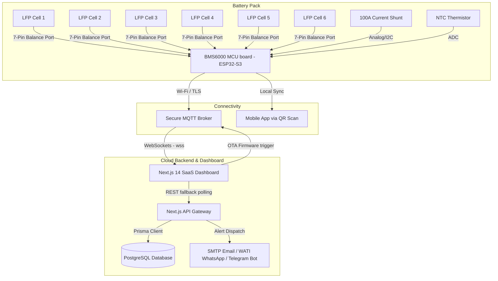

# AXQUBIT BMS6000 Series Smart Battery Management System Dashboard

An industrial-grade, production-ready IoT SaaS dashboard designed for **AXQUBIT Technologies** (Vadodara, Gujarat) to monitor, diagnose, and maintain the **BMS6000 Series 6S LiFePO4 Smart Battery Management System**.

This platform combines real-time telemetry streaming, advanced cell balancing views, historical logs export, Over-the-Air (OTA) firmware flash triggers, and AI-driven health analytics (SOH projection, cell degradation checks, charging stress diagnostics).

---

## ⚡ System Architecture

The AXQUBIT BMS6000 follows a secure, low-latency end-to-end topology enabling real-time battery analytics over secure channels.



---

## 🔌 Hardware & End-to-End Connection Guide

To connect a physical 6S LiFePO4 battery pack to the AXQUBIT BMS6000 MCU and stream data to the dashboard, follow the instructions below:

### 1. Electrical Wiring Details

*   **Cell Balancing Harness**: Connect the 7-pin balancing connector to the LFP battery terminals:
    *   **Pin 1 (B-)**: Connect to Cell 1 Negative (main pack negative).
    *   **Pin 2 (B1)**: Connect to junction between Cell 1 Positive & Cell 2 Negative.
    *   **Pin 3 (B2)**: Connect to junction between Cell 2 Positive & Cell 3 Negative.
    *   **Pin 4 (B3)**: Connect to junction between Cell 3 Positive & Cell 4 Negative.
    *   **Pin 5 (B4)**: Connect to junction between Cell 4 Positive & Cell 5 Negative.
    *   **Pin 6 (B5)**: Connect to junction between Cell 5 Positive & Cell 6 Negative.
    *   **Pin 7 (B+)**: Connect to Cell 6 Positive (main pack positive).
*   **Current Shunt**: Wire a high-precision low-side current shunt (e.g., 75mV/100A shunt) in series with the main pack negative wire (`B-` to `P-` load terminal) and hook the shunt sense leads to the BMS ADC inputs.
*   **Temperature Sensors**: Affix the NTC thermistor probe to the middle cells (Cell 3 or 4) to monitor peak pack temperature.

### 2. ESP32-S3 Microcontroller Firmware Configuration

The BMS6000 onboard ESP32-S3 runs a FreeRTOS firmware package. It polls the analog registers every 500ms and publishes telemetry JSON payloads over secure WebSockets.

#### Connecting the ESP32 to the Dashboard:
1.  **Configure Credentials**: Flash the ESP32 with your Wi-Fi SSID, Wi-Fi Password, and MQTT broker endpoint matching the dashboard's `.env.local` settings.
2.  **Define MQTT Client Client ID**: Ensure the ESP32 uses a unique client ID, typically containing its MAC address or serial number (e.g., `AXQ-BMS6000-LFP-082301`).

---

## 📡 MQTT API & Topic Registry

The communication between the physical BMS and the SaaS Dashboard uses the following MQTT topics (replace `{serialNumber}` with your pack's ID, e.g., `AXQ-BMS6000-LFP-082301`):

### 1. Telemetry Topic: `axqubit/bms/{serialNumber}/telemetry`
Published by the BMS every **500ms** to update overall pack parameters.

#### JSON Payload Schema:
```json
{
  "serialNumber": "AXQ-BMS6000-LFP-082301",
  "timestamp": "2026-06-23T11:20:00.000Z",
  "soc": 78.4,
  "soh": 99.2,
  "voltage": 19.92,
  "current": -2.5,
  "power": -49.8,
  "packTemp": 29.5,
  "cycleCount": 124,
  "isCharging": false,
  "isDischarging": true,
  "isBalancing": false,
  "status": "normal",
  "chargingMode": "idle",
  "remainingCapacity": 78.4,
  "nominalCapacity": 100.0,
  "energyThroughput": 248.5,
  "protectionFlags": {
    "ovp": false,
    "uvp": false,
    "ocp": false,
    "scp": false,
    "otp": false,
    "utp": false,
    "covp": false,
    "cuvp": false
  }
}
```

### 2. Cell Data Topic: `axqubit/bms/{serialNumber}/cells`
Published by the BMS every **500ms** containing individual metrics for the 6 cells in series.

#### JSON Payload Schema:
```json
[
  { "cellNumber": 1, "voltage": 3.325, "temp": 29.2, "isBalancing": false, "deltaV": 0 },
  { "cellNumber": 2, "voltage": 3.321, "temp": 29.1, "isBalancing": false, "deltaV": 0 },
  { "cellNumber": 3, "voltage": 3.328, "temp": 29.5, "isBalancing": false, "deltaV": 0 },
  { "cellNumber": 4, "voltage": 3.319, "temp": 29.4, "isBalancing": false, "deltaV": 0 },
  { "cellNumber": 5, "voltage": 3.324, "temp": 29.2, "isBalancing": false, "deltaV": 0 },
  { "cellNumber": 6, "voltage": 3.327, "temp": 29.3, "isBalancing": false, "deltaV": 0 }
]
```

### 3. OTA Command Topic: `axqubit/bms/{serialNumber}/ota/command`
Subscribed to by the BMS. The dashboard publishes to this topic when a user initiates a firmware update.

#### JSON Payload Schema:
```json
{
  "command": "START_OTA",
  "firmwareUrl": "https://firmware.axqubit.com/bms6000/v1.1.0-release.bin",
  "version": "v1.1.0",
  "timestamp": "2026-06-23T11:20:00.000Z"
}
```

---

## 🧠 AI Diagnostic & Software Features

The SaaS Dashboard incorporates advanced analytics driven by a custom physics-informed AI script:

1.  **State of Charge (SOC) Indicator**: A custom-designed SVG semicircle gauge with an animated colored gradient (`#00d4ff` to `#00e676`) updating smoothly.
2.  **60s Realtime Streams**: Live rolling charts for overall pack voltage, current draw, power flow, and temperature utilizing zero-latency Chart.js configurations.
3.  **State of Health (SOH) Prediction**: Runs a linear regression model (`y = mx + c`) on cycle logs to project the capacity fade curve and calculate the **Remaining Useful Life (RUL)** before hitting the 80% End-of-Life (EOL) limit.
4.  **Cell Degradation Check**: Computes the pack voltage average in real-time. If any individual cell voltage deviates by more than **25mV (0.025V)**, it identifies the cell as an outlier, flags it on the UI, and suggests a manual balance check.
5.  **Charging C-Rate Advisor**: Evaluates charging/discharging current. If the current exceeds **0.3C** (30A for a 100Ah pack), it issues a warning recommending a charge current reduction to prevent cell anode plating and stress.
6.  **Dual-Mode Connectivity**: The interface automatically defaults to the high-frequency MQTT WebSocket stream. If the connection fails or drops, it switches to polling the Next.js API fallback routes every 1000ms.

---

## 🛠️ Local Development & Quick Start

Follow these steps to run the dashboard on your machine:

### 1. Clone the Repository
```bash
git clone https://github.com/SAHIL-3108/axqubit-bms-dashboard.git
cd axqubit-bms-dashboard
```

### 2. Install Dependencies
```bash
npm install
```

### 3. Configure the Environment Files
Copy the example environment configuration:
```bash
cp .env.local.example .env.local
```
Fill in the parameters in `.env.local` (e.g., PostgreSQL `DATABASE_URL`, MQTT broker configurations, and email/WhatsApp credentials). Refer to the detailed **[SETUP_GUIDE.md](SETUP_GUIDE.md)** for account creations.

### 4. Build the Database (Prisma Client)
Synchronize the models to your local or cloud PostgreSQL database:
```bash
npx prisma generate
npx prisma db push
```

### 5. Run the Local Development Server
```bash
npm run dev
```
Open **[http://localhost:3000/dashboard](http://localhost:3000/dashboard)** in your browser to view the running dashboard.

---

## 🚀 Production Deployment

Deploy the dashboard directly to **Vercel** for hosting:

1.  Log in to the Vercel CLI:
    ```bash
    npx vercel login
    ```
2.  Deploy the application:
    ```bash
    npx vercel --prod --yes
    ```
3.  In your Vercel Project Settings, add all variables defined in your `.env.local`.

---

*Designed and Built by AXQUBIT Technologies Engineering — Gujarat, India.*
